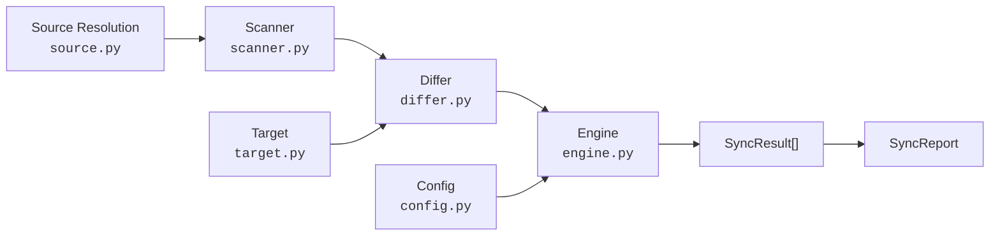
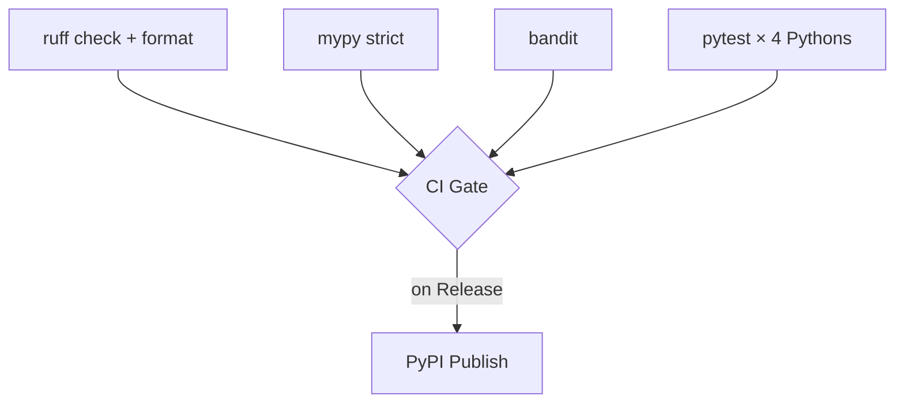

<h1 align="center">agentfiles</h1>

<p align="center">
  <strong>Sync AI tool configurations for OpenCode</strong>
</p>

<p align="center">
  <a href="https://pypi.org/project/agentfiles/">
    
  </a>
  <a href="https://pypi.org/project/agentfiles/">
    
  </a>
  <a href="https://github.com/svetlovtech/agentfiles/actions">
    
  </a>
  <a href="https://docs.astral.sh/ruff/">
    
  </a>
  <a href="https://mypy.readthedocs.io/">
    
  </a>
  <a href="https://github.com/PyCQA/bandit">
    
  </a>
  <a href="LICENSE">
    
  </a>
</p>

<p align="center">
  <code>pip install agentfiles</code>
</p>

---

`agentfiles` is a CLI that keeps your OpenCode AI coding assistant configurations — agents, skills, commands, and plugins — in sync. Treat a source repository as the single source of truth and propagate changes to your local OpenCode config.

## Why?

You manage OpenCode agents, skills, commands, and plugins across multiple machines or projects. `agentfiles` lets you maintain **one repository** and sync everywhere:

```
source repo ──────── OpenCode (~/.config/opencode/)
(agents/skills/
 commands/plugins)
```

## Features

- **OpenCode support** — agents, skills, commands, plugins, configs, and workflows
- **Bidirectional sync** — pull and push with conflict detection
- **Surgical filtering** — `--only`, `--except`, `--type`, `--item agent/coder`, `--scope`
- **PR creation** — `push --create-pr` to auto-create a pull request via `gh`
- **Smart cloning** — shallow clone + sparse checkout for remote sources
- **Dry-run** — preview changes without applying
- **Diagnostics** — `doctor`, `verify` (CI drift detection), shell completions
- **One dependency** — `pyyaml` only

## Quick Start

```bash
pip install agentfiles
```

```bash
# Initialize a new repository
agentfiles init

# Pull to OpenCode
agentfiles pull /path/to/source-repo

# Pull only agents
agentfiles pull --type agent

# Preview without applying
agentfiles pull --dry-run
```

## Commands

| Command | Description |
|---------|-------------|
| [`pull`](#pull) | Install/update items from source to local OpenCode config |
| [`push`](#push) | Push local items back to source (with conflict detection) |
| [`status`](#status) | Show installed items (`--list`, `--diff`) |
| [`clean`](#clean) | Remove orphaned items |
| [`init`](#init) | Scaffold a new repository |
| [`verify`](#verify) | CI-friendly drift detection (exit 1 if drift) |
| [`doctor`](#doctor) | Run environment diagnostics |
| [`completion`](#completion) | Generate shell completion scripts |

### `pull`

Install or update items from a source repository to your local OpenCode config.

```bash
agentfiles pull                                    # interactive (default)
agentfiles pull --yes                              # non-interactive
agentfiles pull --update                           # git pull source, then sync
agentfiles pull --type agent                       # only agents
agentfiles pull --only coder,solid-principles      # specific items
agentfiles pull --item agent/coder                 # single item by key
agentfiles pull --dry-run --verbose                # preview with details
agentfiles pull --symlinks                         # use symlinks instead of copies
agentfiles pull --full-clone                       # disable shallow clone optimization
agentfiles pull --scope global                     # only global-scope items
agentfiles pull --scope project --project-dir .    # project-scope items to current dir
```

### `push`

Push locally-installed items back into the source repository. Useful when you've edited configs on one machine and want to propagate.

```bash
agentfiles push                         # interactive (with conflict detection)
agentfiles push --yes                   # non-interactive (skips conflicts)
agentfiles push --dry-run               # preview
agentfiles push --item agent/coder      # push a single item
agentfiles push --create-pr             # auto-create PR via gh
agentfiles push --create-pr --pr-title "Update agents" --pr-branch my-branch
```

### `status`

Show installed-item information. Supports two sub-modes via flags:

- `--list` — list items available in the source repository
- `--diff` — compare source vs installed items

```bash
agentfiles status                            # show overview
agentfiles status --format json              # JSON output

# --list mode: list source items
agentfiles status --list                     # text table
agentfiles status --list --tokens            # include token estimates
agentfiles status --list --format json       # machine-readable

# --diff mode: compare source vs installed
agentfiles status --diff                     # show differences
agentfiles status --diff --verbose           # content-level diffs
agentfiles status --diff --format json       # machine-readable
```

### `clean`

Remove installed items whose source no longer exists in the repository.

```bash
agentfiles clean --dry-run      # preview
agentfiles clean --yes          # non-interactive
```

### `init`

Scaffold a new agentfiles repository with `agents/`, `skills/`, `commands/`, `plugins/` directories and a `.agentfiles.yaml` config.

```bash
agentfiles init                              # current directory
agentfiles init /path/to/project             # specific directory
agentfiles init --yes                        # skip confirmation
```

### `verify`

CI-friendly drift detection. Compares source vs installed items, exits 0 if in sync, 1 if drift detected.

```bash
agentfiles verify                    # human-readable output
agentfiles verify --format json      # machine-readable
agentfiles verify --quiet            # silent, exit code only
```

### `doctor`

Run environment diagnostics — checks config, source dir, git, platform directory, state file, and tool binaries.

```bash
agentfiles doctor
```

### `completion`

Generate shell completion scripts.

```bash
agentfiles completion bash    # bash completions
agentfiles completion zsh     # zsh completions
agentfiles completion fish    # fish completions

# Example: add to .bashrc
eval "$(agentfiles completion bash)"
```

## Global Options

```
--color {always,auto,never}   Color output control (respects NO_COLOR/FORCE_COLOR)
--verbose, -v                 Verbose output
--quiet, -q                   Quiet mode (errors only)
--version                     Show version
```

## Filter Options

Most commands support surgical filtering:

```bash
--type {agent,skill,command,plugin,config,workflow,all} Item type
--only coder,solid-principles                          Only these items (by name)
--except old-plugin,deprecated                         Exclude these items
--item agent/coder                                     Specific item by type/name key
--scope {global,project,local,all}                     Filter by scope
```

## Source Repository Structure

```
my-agents/
├── agents/
│   ├── coder/
│   │   └── coder.md              # YAML frontmatter + prompt
│   └── debugger/
│       └── debugger.md
├── skills/
│   ├── solid-principles/
│   │   ├── SKILL.md
│   │   └── references/
│   └── dry-principle/
│       └── SKILL.md
├── commands/
│   └── autopilot/
│       └── autopilot.md
├── plugins/
│   └── patterns.yaml
├── configs/
│   └── global-settings.yaml
├── workflows/
│   └── deploy-pipeline/
│       └── workflow.md
└── .agentfiles.yaml              # Config (auto-generated)
```

## Supported Platform

| Platform | Config path | Agents | Skills | Commands | Plugins | Configs | Workflows |
|----------|------------|--------|--------|----------|---------|---------|-----------|
| **OpenCode** | `~/.config/opencode/` | ✅ | ✅ | ✅ | ✅ | ✅ | ✅ |

## Architecture



| Module | Purpose |
|--------|---------|
| `source.py` | Resolve user input → local directory (local dir, git URL, git clone) |
| `scanner.py` | Walk source dirs → `list[Item]` |
| `differ.py` | Compare source vs installed: existence → metadata → SHA-256 |
| `engine.py` | Plan actions (INSTALL/UPDATE/SKIP) → execute → collect results |
| `target.py` | Discover OpenCode config directory, manage installed items |
| `config.py` | YAML config + sync-state persistence |
| `cli.py` | Argparse CLI with all subcommands |

### CI Pipeline



### Extending

**Add a new item type:**

1. Add `ItemType` enum value in `models.py`
2. Write a scanner function in `scanner.py`
3. Register via `_register_scanner()`

No other modules need changes (Open/Closed Principle).

## Development

```bash
# Install with dev dependencies
uv sync --dev

# Lint & format
uv run ruff check src/ tests/
uv run ruff format --check src/ tests/

# Type check
uv run mypy src/

# Security scan
uv run bandit -r src/ -c pyproject.toml

# Test
uv run pytest tests/ -v

# Test with coverage
uv run pytest tests/ -v --cov=agentfiles --cov-report=term-missing

# Build package
uv run python -m build
```

## License

[MIT](LICENSE)
